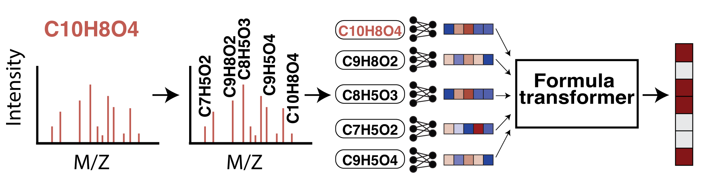

# 🌫️ MIST: Metabolite Inference with Spectrum Transformers

[](https://zenodo.org/badge/latestdoi/564051299)  

This repository provides implementations and code examples for [Metabolite Inference with Spectrum Transformers (MIST)](https://www.nature.com/articles/s42256-023-00708-3). MIST models can be used to predict molecular fingerprints from tandem mass spectrometry data and, when trained in a contratsive learning framework, enable embedding and structure annotation by database lookup. Rather than directly embed binned spectra, MIST applies a transformer architecture to directly encode and learn to represent collections of chemical formula. 

_Samuel Goldman, Jeremy Wohlwend, Martin Strazar, Guy Haroush, Ramnik J. Xavier, Connor W. Coley_



**We are actively working on an updated MIST codebase to accept multiple adduct types, simplify code, and use an internal subformula labeling scheme to reduce reliance on SIRIUS. In the meantime, see [MIST-CF](https://github.com/samgoldman97/mist-cf) for a cleaner implemntation of the formula transformer.**

## Table of Contents

1. [Install & setup](#setup)      
2. [Quick start](#quickstart)   
3. [Data](#data)   
4. [Training models](#training)     
5. [Experiments](#paper)    
6. [Citations](#citations)     


## Install & setup <a name="setup"></a>

After git cloning the repository, the enviornment and package can be installed.  Please note that the enviornment downloaded attempts to utilize cuda11.1. Please comment this line out in enviornment.yml if you do not plan to use gpu support prior to the commands below. We strongly recommend replacing conda with [mamba](https://mamba.readthedocs.io/en/latest/installation.html) for fast install (i.e., `mamba env creaete -f environment.yml`).

```
conda env create -f environment.yml
conda activate ms-gen
pip install -r requirements.txt
python setup.py develop
```

This environment was tested on Ubuntu 20.04.1 with CUDA Version 11.4 . It takes roughly 10 minutes to install using Mamba. 


### SIRIUS <a name="sirius"></a>

A key part of the model involves first mapping tandem mass spectrometry to a parent (MS1) chemical formula and labeling spectrum (MS2) subpeaks with putative subformulae of the parent. While these operations can be replaced with any generic solvers, we utilize the first part of the SIRIUS processing pipeline to extract such annotations. SIRIUS can be downlaoded and moved into a respective folder using the following commands. For non linux based systems, we suggest visiting the [SIRIUS website](https://bio.informatik.uni-jena.de/software/sirius/).  

```
wget https://bio.informatik.uni-jena.de/repository/dist-release-local/de/unijena/bioinf/ms/sirius/4.9.3/sirius-4.9.3-linux64-headless.zip
unzip sirius-4.9.3-linux64-headless.zip
rm sirius-4.9.3-linux64-headless.zip
```

Note that for revisions and direct comparison with CSI:FingerID, SIRIUS 5.0 is used with documentation [here](https://boecker-lab.github.io/docs.sirius.github.io/account-and-license/). Users must receive a license first.


## Quick start <a name="quickstart"></a>

After creating a python enviornment, pretrained models can be used to: 

1. Predict fingerprints from spectra  (`quickstart/model_predictions/fp_preds_quickstart.p`)  
2. Annotate spectra by ranking candidates in a reference smiles list (`quickstart/model_predictions/smiles_outputs.tsv`)  
3. Embed spectra into a dense continuous space  (`quickstart/model_predictions/contrastive_embed.p`)   

To showcase these capabilities, we include an MGF file, `quickstart/quickstart.mgf` as exported by MZMine for use by SIRIUS (a sample from the Mills et al. data), along with a set of sample smiles `quickstart/lookup_smiles.txt`. Running the following pipeline will download pretrained models, reformat the mgf file into labels files, run sirius on the MGF file to identify best chemical formula, prepare the lookup library as an HDF file, and apply the pretrained models accordingly: 

```
conda activate ms-gen
source quickstart/00_download_models.sh
python quickstart/01_reformat_mgf.py
source quickstart/02_run_sirius.sh
python quickstart/03_summarize_sirius.py
python quickstart/04_create_lookup.py
source quickstart/05_run_models.sh
```

Output predictions can be found in `quickstart/model_predictions` and are included by default with the repository. 

We provide a notebook `notebooks/mist_demo.ipynb` that shows these calls programmatically, rather than in the command line.

## Data <a name="data"></a>

Training models requires the use of paired mass spectra data and molecule annotations. We utilize two datasets to train models: 

1. **csi2022**: H+ Spectra from GNPS, NIST, MONA, and others kindly provided by  
   Kai Durkhop from the SIRIUS and CSI:FingerID team. This dataset is used to  
   complete most benchmarking done.
2. **canopus\_train**: Public data extracted from GNPS and prepared by the 2021 CANOPUS methods paper.  
3. **mills**:  A dataset of unlabeled spectra extracted from the IBD cohort study Mills et al. and used for prospective testing.  

Each paired spectra dataset will have the following standardized folders and components, living under a single dataset folder:
 
1. **labels.tsv**: A file containing the columns ["dataset", "spec", "name", "ionization", "formula", "smiles", "inchikey"], where "smiles" coreresponds to an *achiral* version of the smiles string.     
2. **spec\_files**: A directory containing each .ms file in the dataset    
3. **sirius\_outputs**: Outputs of a SIRIUS program run on the corrresponding .ms directory    
4. **magma_outputs**: Outputs of a MAGMa program run on the corresponding spec files directory    
5. **splits**: Splits contains all splist. These are in the form of a table with 2 columns including split name and category (train, val, test, or exclude)   
6. [optional] **prev_results**: Folder to hold any previous results on the dataset if benchmarked by another author   
7. [optional] **retrieval\_hdf**: Folder to hold hdf files used for retrieval. Note we construct these with relevant isomers for the dataset.     
8. [optional] **spec\_preds**: Another part of model training is the use of simulated spectra from a forward model.  After training these different forward models, we store relevant predictions inside spearate folders.     

### Unpaired molecules

MIST can optionally utilize data augmentation by learning a simple model
to map from molecule --> spectrum. We use this model to then produce putative
spectra that enhance MIST model training. Unpaired molecules contains a set of
bio-like molecules extracted from the CANOPUS project to apply these models.
Because these molecules were provided by the CANOPUS authors as InchiKeys, some
work is required to map them back to smiles. A record of this is provided in
`data_processing/forward`.

### Training set download

For those interested in recreating our pipeline for comparison on the canopus\_train dataset, the minimal dataset as we processed must first be downloaded (~3.3G): 

```
cd data/paired_spectra/
wget https://zenodo.org/record/7897324/files/canopus_train_public.tar
tar -xvf canopus_train_public.tar
rm canopus_train_public.tar
cd ../../
```


## Training models <a name="training"></a>

We provide details below to train a minimal model for comparison on the canopus\_train dataset (download instructions described in [Data](#data)). **The config files specify the exact parameters used in experiments as reported in the paper.**

### MIST fingerprint model

A mist model can be trained using the command `python run_scripts/train_mist.py`. The following example trains with 0 gpus (sped up by GPU utilization):

```
mkdir results/model_train_demos
python3 run_scripts/train_mist.py --cache-featurizers --dataset-name 'canopus_train_public' --fp-names morgan4096 --num-workers 12 --seed 1 --gpus 0 --split-file 'data/paired_spectra/canopus_train_public/splits/canopus_hplus_100_0.csv' --splitter-name 'preset' --augment-data --augment-prob 0.5 --batch-size 128 --inten-prob 0.1 --remove-prob 0.5 --remove-weights 'exp' --iterative-preds 'growing' --iterative-loss-weight 0.4 --learning-rate 0.00077 --weight-decay 1e-07 --max-epochs 600 --min-lr 0.0001 --lr-decay-time 10000 --lr-decay-frac 0.95 --hidden-size 256 --num-heads 8 --pairwise-featurization --peak-attn-layers 2 --refine-layers 4 --set-pooling 'cls' --spectra-dropout 0.1 --single-form-encoder --recycle-form-encoder --use-cls --cls-type 'ms1' --loss-fn 'cosine' --magma-aux-loss --frag-fps-loss-lambda 8 --magma-modulo 512 --patience 30 --save-dir 'mist_fp_model' --save-dir results/model_train_demos/mist_fp_model
``` 

For illustrative purposes, this call does not utilize forward augmented data.

Model predictions can be generated using the arguments specified by `run_scripts/pred_fp.py` with an example call shown in the `quickstart`.

### FFN binned model

As a baseline, we also train FFN models similar to MetFID using the command `python run_scripts/train_ffn_binned.py`. Example usage: 

```
python3 run_scripts/train_ffn_binned.py --cache-featurizers --dataset-name 'canopus_train_public' --fp-names morgan4096 --num-workers 12 --seed 1 --gpus 0 --split-file 'data/paired_spectra/canopus_train_public/splits/canopus_hplus_100_0.csv' --splitter-name 'preset' --augment-prob 0.5 --batch-size 128 --inten-prob 0.1 --remove-prob 0.5 --remove-weights 'exp' --iterative-loss-weight 0.5 --iterative-preds 'none' --learning-rate 0.00087 --weight-decay 1e-07 --max-epochs 600 --min-lr 1e-05 --lr-decay-time 10000 --hidden-size 512 --num-spec-layers 2 --num-bins 11000 --spectra-dropout 0.3 --patience 60 --loss-fn 'cosine' --save-dir 'ffn_fp_model' --save-dir results/model_train_demos/ffn_fp_model
```

The same `run_scripts/pred_fp.py` script can be used to make predicitons with a trained model.


### Contrastive models

Contrastive models can be trained using the command `python run_scripts/train_train_contrastive.py`. These require first generating hdf files containing isomeric decoys as negative examples for the contrastive learning loss function from PubChem. 

The version of pubchem we use can be downloaded and moved into the appropriate data folder (~7GB):

```
mkdir data/raw/
mkdir data/raw/pubchem
cd data/raw/pubchem
wget https://zenodo.org/record/8084088/files/cid_smiles.txt

```

After downloading pubchem, a new retrieval database can be generated using the following commands, which will build hdf files taking >20G of space for retrieval and contrastive learning:

```
python3 data_processing/canopus_train_public/01_retrieval_hdf.py
```

Contrastive models can be trained afterward.


```
python3 run_scripts/train_contrastive.py --seed 1 --dataset-name 'canopus_train_public' --compound-lib 'intpubchem' --splitter-name 'preset' --augment-data --augment-prob 0.5 --remove-prob 0.5 --remove-weights 'exp' --inten-prob 0.1 --frac-orig 0.2 --dist-name 'cosine' --contrastive-loss 'nce' --contrastive-decoy-pool 'mean' --contrastive-latent 'h0' --contrastive-weight 0.6 --contrastive-scale 16 --contrastive-bias 0.0 --num-decoys 64 --max-db-decoys 256 --decoy-norm-exp 4 --negative-strategy 'hardisomer_tani_pickled' --learning-rate 0.00057 --weight-decay 1e-07 --min-lr '5e-06' --scheduler --lr-decay-time 10000 --lr-decay-frac 0.7138 --patience 10 --max-epochs 500 --gpus 0 --batch-size 32 --num-workers 12 --cache-featurizers --ckpt-file 'results/model_train_demos/mist_fp_model/Fold_100_0/best.ckpt' --split-file 'data/paired_spectra/canopus_train_public/splits/canopus_hplus_100_0.csv' --save-dir 'contrast_model' --save-dir results/model_train_demos/contrast_model
```

Once this model is trained, it can be used to extract contrastive embeddings
(`run_scripts/embed_contrastive`) or conduct retrieval
(`run_scripts/retrieval_contrastive.py`) for a dataset as well (e.g,. to build
UMAP or do distance comparisons)


### Forward models

Forward models can be learned using `run_scripts/train_forward_ffn.py` and predicted with `python run_scripts/predict_forward_ffn.py`

Once forward predictions are made on new molecules, these predictions can be extracted and assigned chemical formulae to be used to augment the MIST training procedure with processings cripts including in `data_processing/forward`. 


## Experiments <a name="paper"></a>   

### Retrospective benchmarking

To compare models against ours in the future, we recommend using the splits below and referencing reported numbers in our paper for cosine similarity and log likelihoods:  

1. `data/paired_spectra/canopus_train_public/splits/canopus_hplus_100_0.csv`  
2. `data/paired_spectra/canopus_train_public/splits/canopus_hplus_100_1.csv`  
3. `data/paired_spectra/canopus_train_public/splits/canopus_hplus_100_2.csv`  

For retrieval comparisons, all retrieval accuracies are reported using PubChem and the downloaded smiles [here](https://zenodo.org/record/8084088/files/cid_smiles.txt).

To see the exact call signatures used to train our models, we have provided yaml config files in `configs/paper_experiments`, which can be directly converted into experiments using `python launcher_scripts/run_from_config.py [config.yaml]`. We suggest switching "launch\_method" to "local" in the config if intending to re-run from config files. 

While not meant to be re-run directly, we also folders titled `run_scripts/fig_2`, `run_scripts/fig_3`, `run_scripts/fig_45_mills`, `run_scripts/fig_6`, which provide a record of all call signatures utilized to generate figures and results included in our manuscript after model training.


### Mills et al. prospective analysis

To reanalyze data from Mills et al., an ensemble of MIST fingerprint and contrastive models are trained and used to embed & annotate new spectra. The data from this analysis can be downloaded [here](https://zenodo.org/record/8084088/files/mills.tar):

```
mkdir data/raw
cd data/raw/
wget https://zenodo.org/record/8084088/files/mills.tar
tar -xvf mills.tar
rm mills.tar
```

This output will add three folders into `data/raw/mills`:

1. `Mills_mzxml`: Contains exports from MZMine3, including raw mgf  
2. `cohort_meta`: Cohort meta data extracted from Mills et al.    
3. `model_predictions`: Model predictions and embeddings on the spectra  

The jupyter python notebook `notebooks/04_mills_analysis` contains this analysis using these files.


## Citations <a name="citations"></a>  

We ask users to cite [MIST](https://www.biorxiv.org/content/10.1101/2022.12.30.522318v1) directly by referencing the following paper:

Goldman, S., Wohlwend, J., Stražar, M. et al. Annotating metabolite mass spectra with domain-inspired chemical formula transformers. Nat Mach Intell (2023). https://doi.org/10.1038/s42256-023-00708-3   

MIST also builds on a number of other projects, ideas, and software including SIRIUS, MAGMa substructure labeling, the canopus\_train data, the Mills et al. IBD data, NPClassifier to classify compounds, PubChem as a retrieval library, and HMDB as a retrieval library. Please consider citing the following full list of papers when relevant:  
 
1. Kai Dührkop, Markus Fleischauer, Marcus Ludwig, Alexander A. Aksenov, Alexey V. Melnik, Marvin Meusel, Pieter C. Dorrestein, Juho Rousu, and Sebastian Böcker, SIRIUS 4: Turning tandem mass spectra into metabolite structure information. Nature Methods 16, 299–302, 2019.   
2. Ridder, Lars, Justin JJ van der Hooft, and Stefan Verhoeven. "Automatic compound annotation from mass spectrometry data using MAGMa." Mass Spectrometry 3.Special_Issue_2 (2014): S0033-S0033.    
3. Wang, Mingxun, et al. "Sharing and community curation of mass spectrometry data with Global Natural Products Social Molecular Networking." Nature biotechnology 34.8 (2016): 828-837.    
4. Dührkop, Kai, et al. "Systematic classification of unknown metabolites using high-resolution fragmentation mass spectra." Nature Biotechnology 39.4 (2021): 462-471.   
5. Mills, Robert H., et al. "Multi-omics analyses of the ulcerative colitis gut microbiome link Bacteroides vulgatus proteases with disease severity." Nature Microbiology 7.2 (2022): 262-276.   
6. Kim, Hyun Woo, et al. "NPClassifier: a deep neural network-based structural classification tool for natural products." Journal of natural products 84.11 (2021): 2795-2807.   
7. Kim, Sunghwan, et al. "PubChem 2019 update: improved access to chemical data." Nucleic acids research 47.D1 (2019): D1102-D1109.    
8. Wishart, David S., et al. "HMDB 5.0: the human metabolome database for 2022." Nucleic Acids Research 50.D1 (2022): D622-D631.
